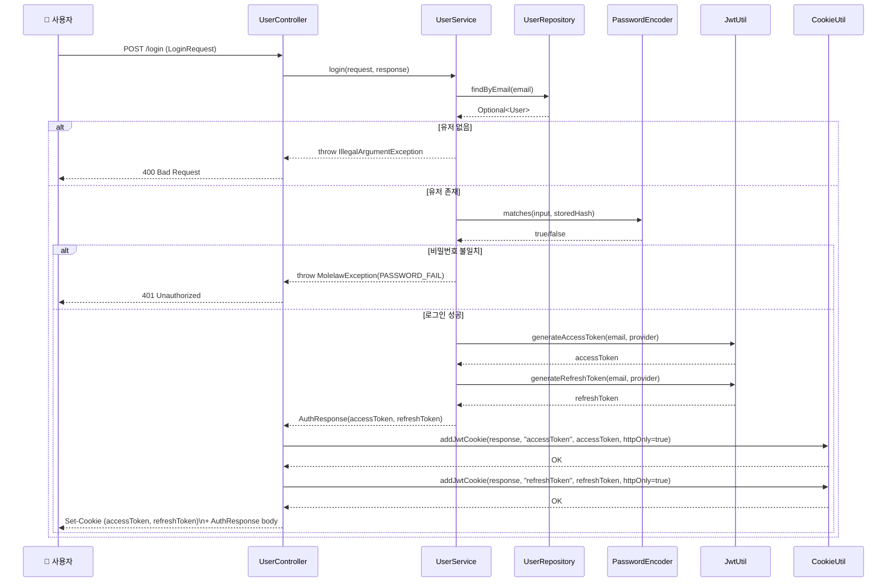
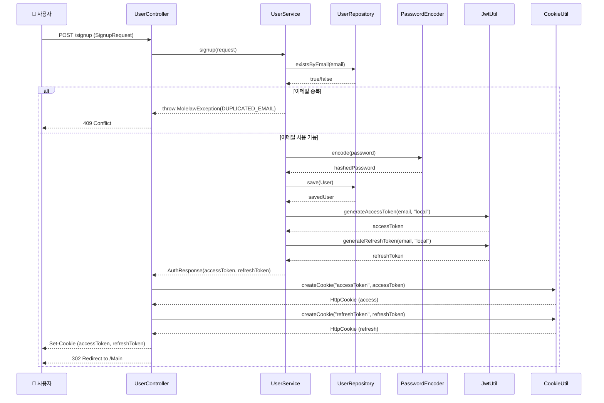
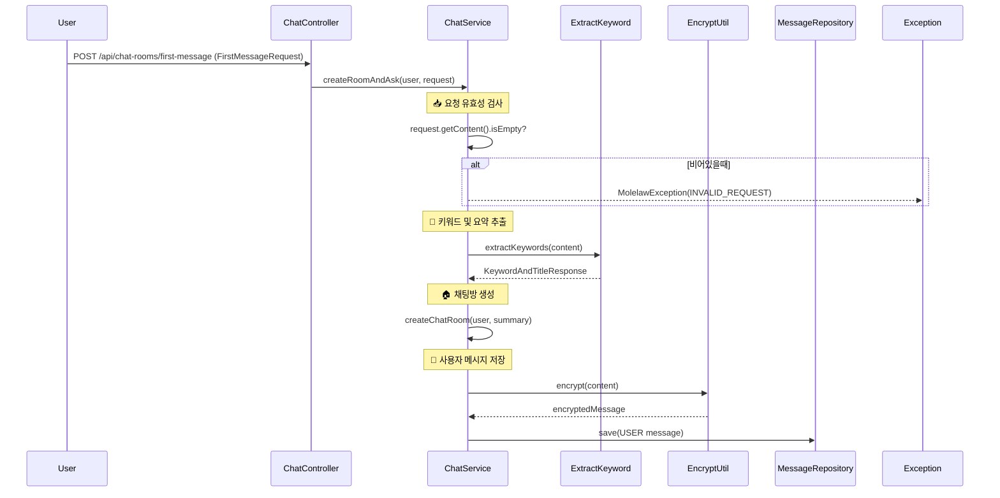
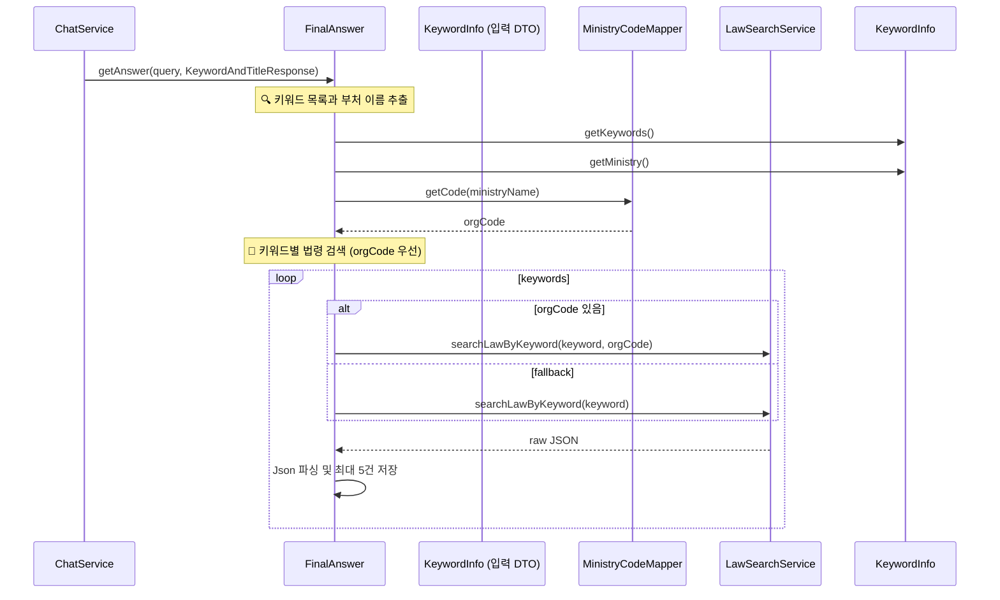
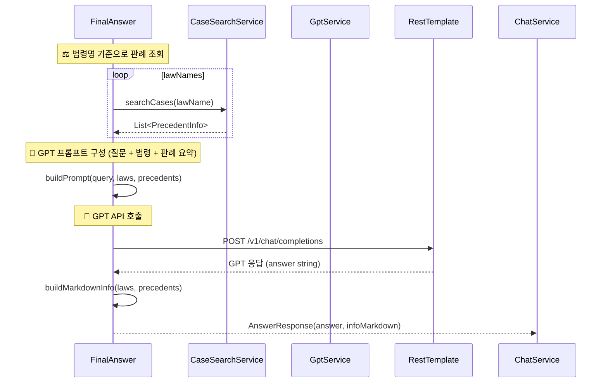
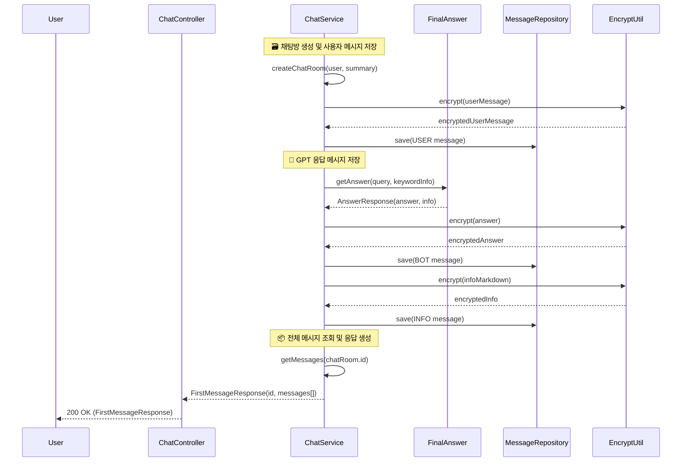

# 📘 MoleLaw 기능 정의서

## 🧩 핵심 개요

- **서비스명**: MoleLaw (몰루로 묻고 법으로 답하다)
- **설명**: 사용자의 법률 질문을 받아 GPT가 관련 법령 및 판례를 검색해 자동 응답하는 상담형 챗봇 서비스
- **DB**: MySQL
- **API 기반**: OpenLaw API (법령 / 판례)

---

## 🧱 핵심 Entity 구조 (RDB: MySQL)

### 📄 User

| 필드명      | 타입     | 제약조건                   | 설명                     |
| -------- | ------ | ---------------------- | ---------------------- |
| id       | Long   | PK                     | 사용자 ID                 |
| email    | String | Unique(email+provider) | 이메일                    |
| password | String |                        | 암호화 저장                 |
| nickname | String |                        | 닉네임                    |
| provider | String |                        | google / kakao / local |

- 관계: `User 1 : N ChatRoom`

### 📄 ChatRoom

| 필드명       | 타입            | 제약조건 | 설명         |
| --------- | ------------- | ---- | ---------- |
| id        | Long          | PK   | 채팅방 ID     |
| title     | String        |      | 요약 제목      |
| user\_id  | FK → User(id) |      | 소유 유저      |
| createdAt | LocalDateTime |      | 생성 시 자동 등록 |

- 관계: `ChatRoom 1 : N Message`

### 📄 Message

| 필드명          | 타입                   | 제약조건  | 설명     |
| ------------ | -------------------- | ----- | ------ |
| id           | Long                 | PK    | 메시지 ID |
| chatRoom\_id | FK → ChatRoom(id)    |       | 소속 채팅방 |
| sender       | Enum (USER/BOT/INFO) |       | 보낸이 구분 |
| content      | TEXT                 | 암호화됨  | 메시지 본문 |
| timestamp    | LocalDateTime        | 자동 등록 | 생성 시각  |

---

## 🧠 기능 흐름도

### - 로그인 흐름

#### 자체 로그인 로직


#### 자체 회원가입 로직


### - GPT 첫 응답 생성 흐름 
####  0단계: 사용자 질문 → 유효성 검증 → 키워드 추출 → 채팅방 생성 → 질문 메시지 저장


#### 1단계: 키워드와 부처 기반 법령 검색 시퀀스


#### 2단계: 판례 검색 및 gpt 응답 생성 시퀀스


#### 3단계: 메시지 저장 및 FirstMessageResponse 반환



---

## ✅ 예외 처리

- 모든 예외는 `MolelawException`을 통해 제어
- `ErrorCode` 기반의 에러 메시지 일원화

```java
throw new MolelawException(ErrorCode.INVALID_REQUEST, "입력 없음");
```

---

## 🔐 인증 및 로그인 방식

- `JWT` 기반 인증 (Access + Refresh)
- 로그인 방식 3종:
  - Google 소셜 로그인
  - Kakao 소셜 로그인
  - 자체 local 로그인
- 회원가입 시 이메일+provider로 유일성 보장
- JWT는 쿠키 기반 전달 (`httpOnly`, `secure`, `sameSite=Lax`)

---

## 📘 Swagger 기반 API 구조

(※ 컨트롤러 기준 정리된 전체 API 목록은 추후 부록에 포함)

- `UserController`: 회원가입, 로그인, 로그아웃, 정보조회/수정/삭제, 토큰 재발급 등
- `ChatController`: 채팅방 생성, 메시지 등록, 대화 흐름 등

---

## 🗃️ 저장소 및 관리 규칙

- 본 정의서는 프로젝트에 파일로 저장되며, 기능 추가/변경 시 지속적으로 업데이트됨
- 모든 데이터는 MySQL에 저장되고, OpenLaw API 결과는 별도 저장하지 않음 (프롬프트 내 사용)
