# 📘 MoleLaw 기능 정의 요약

## 🧩 프로젝트 개요

| 항목           | 내용                                                                 |
|----------------|----------------------------------------------------------------------|
| **서비스명**   | MoleLaw (몰루로 묻고 법으로 답하다)                                     |
| **설명**       | 사용자의 법률 질문을 받아 GPT가 관련 법령 및 판례를 검색하여 자동 응답하는 상담형 챗봇 서비스 |
| **DB**         | MySQL                                                                |
| **언어/프레임워크** | Java 17 / Spring Boot 3.5.0                                          |
| **외부 API**   | OpenLaw API (법령/판례), OpenAI API (GPT 응답, 임베딩 벡터 생성)         |

---
## 🧩 의존성 목록 (build.gradle 기준)

### 🔧 Spring Boot Starters
- `spring-boot-starter-data-jpa`: JPA 기반 ORM
- `spring-boot-starter-security`: 로그인, 인증, 권한 관리
- `spring-boot-starter-web`: 전통적인 MVC 웹 지원
- `spring-boot-starter-webflux`: WebClient 기반 비동기 통신 지원
- `spring-boot-starter-oauth2-client`: 소셜 로그인 (Google, Kakao 등)
- `spring-boot-starter-validation`: javax 검증 어노테이션 처리

### 🛠️ 추가 라이브러리
- `me.paulschwarz:spring-dotenv`: .env 환경변수 지원
- `com.fasterxml.jackson.core:jackson-databind`: JSON ↔ Java 객체 매핑

### 📄 Swagger
- `springdoc-openapi-starter-webmvc-ui:2.8.4`: Swagger UI 제공

### 🔐 JWT 관련 (JJWT)
- `jjwt-api:0.11.5`: JWT 생성/파싱/검증
- `jjwt-impl:0.11.5`: JWT 내부 구현체
- `jjwt-jackson:0.11.5`: JWT ↔ JSON 직렬화 지원

### 🧪 테스트 / 개발 도구
- `spring-boot-starter-test`, `spring-security-test`: 통합 테스트
- `spring-boot-devtools`: 개발 환경 자동 재시작
- `junit-platform-launcher`: 테스트 런타임
- `lombok` + `annotationProcessor`: 보일러플레이트 제거

### 🛢️ DB 관련
- `mysql-connector-j:8.0.33`: MySQL 드라이버


### 🔐 인증/보안
- `spring-boot-starter-security`: 인증/인가 처리
- `spring-boot-starter-oauth2-client`: Google/Kakao 소셜 로그인
- JWT 관련:
  - `jjwt-api`: JWT 생성/파싱/검증 API
  - `jjwt-impl`: JWT 내부 동작 구현
  - `jjwt-jackson`: JWT ↔ JSON 변환 (Jackson 연동)
- 쿠키 기반 토큰 전달 (`httpOnly`, `secure`, `SameSite=Lax`)

### 🧪 API 문서화
- `springdoc-openapi-starter-webmvc-ui`: Swagger UI 자동 생성 (`/swagger-ui.html`)

---

## 🧱 핵심 Entity 구조 (RDB: MySQL)


```mermaid
erDiagram
  USER ||--o{ CHATROOM : has
  CHATROOM ||--o{ MESSAGE : has
  LAW ||--o{ LAWCHUNK : has
  LAWCHUNK ||--|| LAWEMBEDDING : has

  USER {
    Long id PK
    String email "Unique (email + provider)"
    String password
    String nickname
    String provider "google / kakao / local"
  }

  CHATROOM {
    Long id PK
    String title
    Long user_id FK
    LocalDateTime createdAt
  }

  MESSAGE {
    Long id PK
    Long chat_room_id FK
    Enum sender "USER / BOT / INFO"
    Text content "암호화됨"
    LocalDateTime timestamp
  }

  LAW {
    Long id PK
    String name "법령명(한글)"
    String lawCode "법령ID (OpenLaw)"
    String department "소관 부처"
  }

  LAWCHUNK {
    Long id PK
    Long law_id FK
    String articleNumber
    String clauseNumber
    Int chunkIndex "0=조문, 1=항, 2=목"
    Text contentText
    LocalDateTime createdAt
  }

  LAWEMBEDDING {
    Long id PK
    Long chunk_id FK "Unique"
    Blob embeddingVector "1536차원 float[] 직렬화"
    String model
    LocalDateTime createdAt
  }

```
- **User**: 이메일 + provider로 복합 고유성 보장
- **ChatRoom**: 사용자별 채팅방
- **Message**: 암호화된 메시지 저장 (USER / BOT / INFO)
- **Law / LawChunk / LawEmbedding**: 법령, 조문 단위, 임베딩 벡터 저장

--- 

## 🔐 로그인 및 인증 흐름

### ✅ 로그인 방식
| 방식     | 설명                     |
|----------|--------------------------|
| Local    | 이메일 + 비밀번호 로그인    |
| Google   | OAuth2 기반 소셜 로그인   |
| Kakao    | OAuth2 기반 소셜 로그인   |

- 로그인/회원가입 시 Access + Refresh 토큰 발급
- **Access Token**: 15분 유효
- **Refresh Token**: 7~30일 유효 (재발급용)

### 🔁 인증 동작 흐름
1. 로그인 성공 시 토큰을 `Set-Cookie`로 전달
2. 클라이언트는 쿠키의 AccessToken으로 인증
3. 만료 시 /reissue 요청으로 재발급 시도
4. Refresh까지 만료되면 재로그인 유도

---

## 🧠 챗봇 응답 처리 흐름

### 1단계: 사용자 질문 수신
- 키워드 추출 (ExtractKeyword)
- 채팅방 생성 + 사용자 메시지 저장

### 2단계: 관련 법령/판례 검색 및 GPT 호출
- **LawSimilarityService**: 유사한 법령 조문 검색 (벡터 유사도 기반)
  - 유사도 부족 시 키워드 기반 fallback 수행
- **CaseSearchService**: 관련 판례 2~5개 검색
- **GptService**: 질문 + 법령 + 판례 기반 GPT 프롬프트 구성 및 응답 생성

### 3단계: 결과 저장 및 응답
- GPT 응답(BOT), infoMarkdown(INFO)을 암호화 후 저장
- 모든 메시지를 클라이언트에 FirstMessageResponse로 반환

---

## 🗃️ 채팅 관련 API 요약

| 경로                        | 설명                             |
|-----------------------------|----------------------------------|
| `GET /api/chat-rooms`       | 사용자의 채팅방 리스트 조회          |
| `GET /api/chat-rooms/{id}`  | 특정 채팅방 메시지 전체 조회         |
| `POST /api/chat-rooms/first-message` | 첫 질문 입력 및 GPT 응답 생성  |
| `POST /api/chat-rooms/followup` | 후속 질문 응답 요청              |
| `DELETE /api/chat-rooms/{id}` | 채팅방 삭제 (메시지 포함)         |

---

## 🚨 공통 예외 처리

- 모든 예외는 `MolelawException`으로 래핑
- `ErrorCode` 열거형 기반 메시지 통일화

| 코드명                            | HTTP 상태코드          | 설명                      |
| ------------------------------ | ------------------ | ----------------------- |
| `INVALID_REQUEST`              | 400                | 잘못된 요청입니다.              |
| `UNAUTHORIZED`                 | 401                | 인증이 필요합니다.              |
| `FORBIDDEN`                    | 403                | 접근 권한이 없습니다.            |
| `NOT_FOUND`                    | 404                | 대상을 찾을 수 없습니다.          |
| `INTERNAL_SERVER_ERROR`        | 500                | 서버 내부 오류입니다.            |
| `OPENLAW_API_FAILURE`          | 502 (BAD\_GATEWAY) | 공공법령 API 통신에 실패했습니다.    |
| `OPENLAW_INVALID_RESPONSE`     | 400                | 공공법령 API 응답이 올바르지 않습니다. |
| `GPT_API_FAILURE`              | 500                | GPT 응답 생성 중 오류 발생       |
| `GPT_EMPTY_RESPONSE`           | 500                | GPT 응답이 비어 있음           |
| `USER_NOT_FOUND`               | 502 (BAD\_GATEWAY) | 해당 사용자를 찾을 수 없습니다.      |
| `USER_ID_NULL`                 | 401                | 사용자 정보가 유효하지 않습니다.      |
| `CHATROOM_NOT_FOUND`           | 404                | 채팅방을 찾을 수 없습니다.         |
| `UNAUTHORIZED_CHATROOM_ACCESS` | 403                | 본인의 채팅방이 아닙니다.          |
| `KEYWORD_EXTRACTION_FAILED`    | 500                | 키워드 추출에 실패했습니다.         |
| `USER_NOT_AUTHENTICATED`       | 401                | 인증되지 않은 사용자입니다.         |
| `PASSWORD_FAIL`                | 400                | 비밀번호가 일치하지 않습니다.        |
| `TOKEN_FAIL`                   | 400                | 유효하지 않은 리프레시 토큰입니다.     |
| `DUPLICATED_EMAIL`             | 400                | 이미 존재하는 이메일입니다.         |
| `INVALID_PROVIDER`             | 400                | 잘못된 형식입니다.              |

---

## 📦 MoleLaw 클래스 다이어그램

아래는 MoleLaw 프로젝트의 주요 클래스 및 관계 구조입니다.


---

## 🧠 로그인 흐름

### 자체 로그인 로직
- 사용자가 이메일/비밀번호로 로그인 요청을 보냄
- 서버는 UserRepository에서 유저를 조회하고, 비밀번호 일치 여부를 확인
- 성공 시 AccessToken / RefreshToken 발급
- 두 토큰은 Set-Cookie 헤더를 통해 클라이언트에 전달됨
```mermaid
sequenceDiagram
  participant User as 🧑 사용자
  participant UserController
  participant UserService
  participant UserRepository
  participant PasswordEncoder
  participant JwtUtil

  User->>UserController: POST /login (LoginRequest)
  UserController->>UserService: login(request, response)

  UserService->>UserRepository: findByEmailAndProvider(email, "local")
  UserRepository-->>UserService: Optional<User>

  alt 유저 없음
    UserService-->>UserController: throw MolelawException(USER_NOT_FOUND)
    UserController-->>User: 400 Bad Request
  else 유저 존재
    UserService->>PasswordEncoder: matches(input, storedHash)
    PasswordEncoder-->>UserService: true/false

    alt 비밀번호 불일치
      UserService-->>UserController: throw MolelawException(PASSWORD_FAIL)
      UserController-->>User: 401 Unauthorized
    else 로그인 성공
      UserService->>JwtUtil: generateAccessToken(email, provider)
      JwtUtil-->>UserService: accessToken

      UserService->>JwtUtil: generateRefreshToken(email, provider)
      JwtUtil-->>UserService: refreshToken

      UserService-->>UserController: AuthResponse(accessToken, refreshToken)
      UserController-->>User: Set-Cookie 헤더로 응답
    end
  end

```

### 자체 회원가입 로직
- 사용자가 이메일/비밀번호/닉네임으로 회원가입 요청을 보냄

- 서버는 동일 이메일+provider 조합이 이미 존재하는지 검사

- 중복이 없다면 유저를 저장하고, JWT를 발급함

- 발급된 AccessToken / RefreshToken은 Set-Cookie 헤더로 응답에 포함됨

- 이후 /Main 페이지로 302 리다이렉트


```mermaid
sequenceDiagram
  participant User as 🧑 사용자
  participant UserController
  participant UserService
  participant UserRepository
  participant PasswordEncoder
  participant JwtUtil

  User->>UserController: POST /signup (SignupRequest)
  UserController->>UserService: signup(request)

  UserService->>UserRepository: existsByEmailAndProvider(email, "local")
  UserRepository-->>UserService: true/false

  alt 이메일 중복
    UserService-->>UserController: throw MolelawException(DUPLICATED_EMAIL)
    UserController-->>User: 409 Conflict
  else 이메일 사용 가능
    UserService->>PasswordEncoder: encode(password)
    PasswordEncoder-->>UserService: hashedPassword

    UserService->>UserRepository: save(User)
    UserRepository-->>UserService: savedUser

    UserService->>JwtUtil: generateAccessToken(email, "local")
    JwtUtil-->>UserService: accessToken

    UserService->>JwtUtil: generateRefreshToken(email, "local")
    JwtUtil-->>UserService: refreshToken

    UserService-->>UserController: AuthResponse(accessToken, refreshToken)
    UserController-->>User: 302 Redirect to /Main (with Set-Cookie 헤더로 응답)
  end

```

### 🔐 MoleLaw - 소셜 로그인 JWT 발급 흐름
☁️ 1단계: 인가 코드 → 액세스 토큰 교환 (OAuth2AccessTokenResponse)
- 사용자가 Google/Kakao 등 OAuth2 인증 서버를 통해 로그인 요청
- Spring Security가 콜백으로 받은 인가 코드를 getTokenResponse()로 전달
- RestTemplate을 이용해 토큰 엔드포인트에 POST 요청
- 액세스 토큰 및 리프레시 토큰을 포함한 JSON 응답을 수신하고 OAuth2AccessTokenResponse 생성
```mermaid
sequenceDiagram
  participant Client as OAuth2 로그인 사용자
  participant SpringSecurity as OAuth2LoginAuthenticationFilter
  participant CustomTokenClient as getTokenResponse()
  participant OAuthProvider as Google/Kakao
  participant RestTemplate

  Note over Client: 인가 코드 발급 완료 (code=xxx)
  Client->>SpringSecurity: GET /login/oauth2/code/{provider}?code=xxx
  SpringSecurity->>CustomTokenClient: getTokenResponse(request)

  Note over CustomTokenClient: 토큰 요청 파라미터 구성
  CustomTokenClient->>RestTemplate: POST TokenEndpoint (tokenUri)
  RestTemplate->>OAuthProvider: form-data (code, client_id, client_secret, redirect_uri, grant_type)

  OAuthProvider-->>RestTemplate: JSON(access_token, refresh_token, expires_in)

  Note over CustomTokenClient: 응답 바디 파싱 및 AccessTokenResponse 구성
  RestTemplate-->>CustomTokenClient: Map (token info)
  CustomTokenClient-->>SpringSecurity: OAuth2AccessTokenResponse

```
🧑‍💻 2단계: 유저 정보 처리 및 JWT 발급
- OAuth2UserService가 응답받은 토큰을 기반으로 사용자 정보를 조회
- 기존 유저가 존재하지 않으면 DB에 신규 유저 등록
- OAuthSuccessHandler가 JWT를 발급하고 쿠키에 저장
- 최종적으로 /Main 페이지로 리다이렉트

```mermaid
sequenceDiagram
  participant Client
  participant OAuthProvider as Google/Kakao
  participant SpringSecurity
  participant CustomOAuth2UserService
  participant UserRepository
  participant JwtUtil
  participant OAuthSuccessHandler

  Note over Client: 소셜 로그인 버튼 클릭
  Client->>OAuthProvider: 인증 요청
  OAuthProvider-->>Client: 인증 코드 리다이렉트

  Client->>SpringSecurity: GET /login/oauth2/code/{provider}?code=xxx

  SpringSecurity->>CustomOAuth2UserService: loadUser(userRequest)
  CustomOAuth2UserService->>OAuthProvider: loadUser (super)
  OAuthProvider-->>CustomOAuth2UserService: OAuth2User attributes

  alt provider == kakao
    CustomOAuth2UserService->>CustomOAuth2UserService: extract kakao_account.email & profile.nickname
  else google
    CustomOAuth2UserService->>CustomOAuth2UserService: extract email & name
  end

  CustomOAuth2UserService->>UserRepository: findByEmailAndProvider(email, provider)
  alt 유저 있음
    UserRepository-->>CustomOAuth2UserService: existing User
  else 신규 생성
    CustomOAuth2UserService->>UserRepository: save(User)
    UserRepository-->>CustomOAuth2UserService: saved User
  end

  CustomOAuth2UserService-->>SpringSecurity: DefaultOAuth2User(email, provider)

  SpringSecurity->>OAuthSuccessHandler: onAuthenticationSuccess()

  OAuthSuccessHandler->>JwtUtil: generateAccessToken(email, provider)
  JwtUtil-->>OAuthSuccessHandler: accessToken

  OAuthSuccessHandler->>JwtUtil: generateRefreshToken(email, provider)
  JwtUtil-->>OAuthSuccessHandler: refreshToken

  Note over OAuthSuccessHandler: 쿠키에 accessToken/refreshToken 저장 처리 (생략)

  OAuthSuccessHandler-->>Client: Redirect → /Main

```

### ✅ MoleLaw - JWT 최초 발급 흐름 (회원가입 / 로그인)
사용자가 회원가입 또는 로그인을 완료하면

서버는 AccessToken, RefreshToken을 생성하고

두 토큰을 각각 HttpOnly 쿠키로 저장한 뒤 응답함
```mermaid
sequenceDiagram
  participant Client
  participant UserController
  participant UserService
  participant JwtUtil
  participant JwtBuilder as JJWT.builder()
  participant CookieUtil
  participant HttpServletResponse

  Note over Client: 회원가입 or 로그인 요청

  Client->>UserController: POST /signup or /login (email, password)
  UserController->>UserService: signup() or login()

  UserService->>JwtUtil: generateAccessToken(email, provider)
  JwtUtil->>JwtBuilder: builder().setSubject(email:provider).signWith(...)
  JwtBuilder-->>JwtUtil: accessToken
  JwtUtil-->>UserService: accessToken

  UserService->>JwtUtil: generateRefreshToken(email, provider)
  JwtUtil->>JwtBuilder: builder().setSubject(email:provider).signWith(...)
  JwtBuilder-->>JwtUtil: refreshToken
  JwtUtil-->>UserService: refreshToken

  UserService-->>UserController: AuthResponse(accessToken, refreshToken)

  UserController->>CookieUtil: addJwtCookie(response, "accessToken", accessToken, true)
  CookieUtil->>HttpServletResponse: Set-Cookie: accessToken

  UserController->>CookieUtil: addJwtCookie(response, "refreshToken", refreshToken, true)
  CookieUtil->>HttpServletResponse: Set-Cookie: refreshToken

  UserController-->>Client: 302 Redirect or Http-only 쿠키 응답
```

### 🔄 토큰 재발행 로직
- 클라이언트가 AccessToken이 만료된 상태에서 /reissue 요청을 보냄
- 서버는 요청 쿠키에서 RefreshToken을 추출하여 유효성 검증
- 유효할 경우, 새로운 AccessToken을 발급하고 쿠키로 반환
- RefreshToken은 재발급하지 않음
- 만료되었을 경우 401 Unauthorized 반환 → 재로그인 유도

```mermaid
sequenceDiagram
    participant Client
    participant UserController
    participant UserService
    participant CookieUtil
    participant JwtUtil
    participant JwtParser
    participant HttpServletResponse

    Note over Client: AccessToken 만료 → /reissue 요청

    Client->>UserController: POST /reissue (쿠키: refreshToken)
    UserController->>UserService: reissue(request, response)

    UserService->>CookieUtil: getTokenFromCookie(request, "refreshToken")
    CookieUtil-->>UserService: refreshToken

    UserService->>JwtUtil: validateToken(refreshToken)
    JwtUtil->>JwtParser: parser().parseClaimsJws(refreshToken)

    alt ✅ 유효함
        JwtParser-->>JwtUtil: Claims
        JwtUtil-->>UserService: true

        UserService->>JwtUtil: getEmailAndProviderFromToken(refreshToken)
        JwtUtil-->>UserService: [email, provider]

        UserService->>JwtUtil: generateAccessToken(email, provider)
        JwtUtil-->>UserService: newAccessToken

        UserService->>CookieUtil: addJwtCookie(response, "accessToken", newAccessToken, true)
        CookieUtil-->>HttpServletResponse: Set-Cookie: accessToken

        UserService-->>UserController: AuthResponse(newAccessToken)
        UserController-->>Client: 200 OK + new AccessToken
    else ❌ 만료됨
        JwtUtil-->>UserService: false
        UserService-->>UserController: throw MolelawException(TOKEN_FAIL)
        UserController-->>Client: 401 Unauthorized (재로그인 필요)
    end
```

--- 
## 🧠 GPT 첫 응답 생성 흐름

###  1단계: 사용자 질문 → 유효성 검증 → 키워드 추출 → 채팅방 생성 → 질문 메시지 저장
- 사용자가 최초 질문을 입력하면, 서버는 요청 유효성 검사를 수행
- 내용이 존재하면 ExtractKeyword를 통해 핵심 키워드 및 요약을 추출
- 해당 정보를 바탕으로 채팅방을 생성
- 사용자의 질문 메시지를 암호화 후 DB에 저장


### 2단계: 법령 검색 및 온디맨드 임베딩 저장 (선택적 단계)
단계	설명
- ✅ 유사도 검색	질문을 벡터화하고 LawEmbeddingRepository 내 모든 조문과 cosine 비교
- ⚠️ Fallback	Top-K이 비어있거나, 최상위 유사도 < 0.6일 경우 키워드 기반 법령 수집 및 임베딩
- ⚖️ 판례 검색	lawName 기준으로 CaseSearchService.searchCases(...) 호출 (OpenLaw API 사용)
- 🧠 GPT 요청	질문 + 법령 chunk + 판례 요약 → GPT-4 호출, 응답 파싱 후 AnswerResponse로 반환
```mermaid
sequenceDiagram
  participant ChatService
  participant FinalAnswer
  participant LawSimilarityService
  participant CaseSearchService
  participant GptService
  participant OpenAI GPT API

  ChatService->>FinalAnswer: getAnswer(question, keywordInfo)

  Note over FinalAnswer: 🔍 1. 유사 법령 조문 찾기
  FinalAnswer->>LawSimilarityService: findSimilarChunksWithFallback(question, topK)

Note over LawSimilarityService: ① 저장된 임베딩에서 cosine 유사도 계산
  Note over LawSimilarityService: ② 유사도 부족하거나 없음 → fallback 실행
  Note over LawSimilarityService: - 질문 키워드 기반으로 법령 검색 & 저장
  Note over LawSimilarityService: - 조문을 임베딩하여 VectorStore에 추가
  Note over LawSimilarityService: - 유사 chunk 재탐색

LawSimilarityService-->>FinalAnswer: List<LawChunk>

Note over FinalAnswer: ⚖️ 2. 관련 판례 검색
FinalAnswer->>CaseSearchService: searchCases(lawName from chunks)

CaseSearchService-->>FinalAnswer: List<PrecedentInfo>

Note over FinalAnswer: 🧠 3. GPT 프롬프트 구성 및 응답 요청
  Note over FinalAnswer: - 질문 + 관련 법령 + 판례로 prompt 구성
  Note over FinalAnswer: - 시스템 프롬프트 포함
  Note over FinalAnswer: - GPT-4 API 호출

FinalAnswer->>GptService: generateAnswer(prompt)
GptService->>OpenAI GPT API: POST /v1/chat/completions
OpenAI GPT API-->>GptService: GPT 응답
GptService-->>FinalAnswer: AnswerResponse(answer + infoMarkdown)

  Note right of ChatService: AnswerResponse(answer, infoMarkdown)
FinalAnswer-->>ChatService: AnswerResponse

```
#### 3단계: 메시지 저장 및 FirstMessageResponse 반환
- ChatService는 사용자 질문과 GPT 응답을 각각 암호화하여 MessageRepository에 저장
- 사용자 메시지: USER, GPT 답변: BOT, 관련 정보: INFO 메시지로 구분되어 저장됨
- 모든 메시지를 채팅방 기준으로 조회한 후, FirstMessageResponse로 클라이언트에 응답
```mermaid
sequenceDiagram
  participant User
  participant ChatController
  participant ChatService
  participant MessageRepository
  participant EncryptUtil

  Note over ChatService: 🤖 2단계에서 받은 AnswerResponse(answer, info)

  Note over ChatService: 🔐 AI 메시지(answer+info) 암호화 후 저장
  ChatService->>EncryptUtil: encrypt(answer)
  EncryptUtil-->>ChatService: encryptedAnswer
  ChatService->>MessageRepository: save(BOT message)

  ChatService->>EncryptUtil: encrypt(infoMarkdown)
  EncryptUtil-->>ChatService: encryptedInfo
  ChatService->>MessageRepository: save(INFO message)

  Note over ChatService: 📦 전체 메시지 조회 및 응답 생성
  ChatService->>MessageRepository: findAllByChatRoom(chatRoomId)
  ChatService-->>ChatController: FirstMessageResponse(id, messages[])
  ChatController-->>User: 200 OK (FirstMessageResponse)
```
### 후속질문 로직
- 두 질문(first + followup)을 합쳐서 프롬프트 구성 (formatted)
- GPT에게 “법률 전문가처럼” 답변 요청
- infoMarkdown은 이 흐름에서는 비어 있음
- WebClient + ObjectMapper 기반의 응답 파싱 방식
```mermaid
sequenceDiagram
  participant ChatService
  participant GptService
  participant WebClient
  participant OpenAI API
  participant ObjectMapper

  Note over ChatService: 🔄 GPT에 첫 질문 + 후속 질문 함께 전달
  ChatService->>GptService: generateAnswerWithContext(first, followup)

  GptService->>WebClient: POST /v1/chat/completions
  WebClient->>OpenAI API: Authorization + JSON(body)

  OpenAI API-->>WebClient: JSON 응답
  WebClient-->>GptService: response (string)

  GptService->>ObjectMapper: readTree(response)
  ObjectMapper-->>GptService: JsonNode

  GptService-->>ChatService: AnswerResponse(answer)

```
---
## 국가법령정보센터(OpenLaw.api), gpt api 로직

### 🧠 법령 키워드 추출 로직 (ExtractKeyword)
- 사용자의 질문을 기반으로 GPT-4 API에 법률 키워드 추출을 요청
- 프롬프트에는 예시 JSON과 키워드 작성 지침이 포함됨
- GPT 응답을 받아 KeywordAndTitleResponse 객체로 역직렬화
- 실패 시 커스텀 예외(GptApiException) 발생
```mermaid
sequenceDiagram
  participant ChatService
  participant ExtractKeyword
  participant GPT as OpenAI GPT-4
  participant ObjectMapper

  Note over ChatService: 사용자 질문 전달
  ChatService->>ExtractKeyword: extractKeywords(userInput)

  Note over ExtractKeyword: 프롬프트 구성 (예시 + 문장 포함)
  ExtractKeyword->>GPT: POST /v1/chat/completions (prompt 포함 JSON)
  GPT-->>ExtractKeyword: JSON 응답 (choices[0].message.content)

  Note over ExtractKeyword: content 파싱 및 매핑
  ExtractKeyword->>ObjectMapper: readValue(content, KeywordAndTitleResponse.class)
  ObjectMapper-->>ExtractKeyword: KeywordAndTitleResponse

  ExtractKeyword-->>ChatService: 키워드 + 요약 + 부처 반환

```

### 🧾 법령 검색 로직 (LawSearchService)

#### 🔍 1단계: 유사 법령 조문 찾기 (with fallback)
✅ 핵심 기능 흐름 요약
- 질문을 벡터로 임베딩하여 기존 LawEmbedding들과 cosine 유사도 비교

- 결과가 없거나 유사도가 낮으면 → fallback: 키워드 기반 법령 검색 & 저장 & 재임베딩 후 재탐색
```mermaid
sequenceDiagram
  participant FinalAnswer
  participant LawSimilarityService
  participant EmbeddingService
  participant LawEmbeddingRepository
  participant ExtractKeyword
  participant LawSearchService
  participant LawEmbeddingService
  participant OpenAI Embedding API
  participant LawChunkRepository

  FinalAnswer->>LawSimilarityService: findSimilarChunksWithFallback(question, topK)

  Note over LawSimilarityService: 🔸 질문을 벡터로 변환
  LawSimilarityService->>EmbeddingService: generateEmbedding(question)
  EmbeddingService-->>LawSimilarityService: queryVec

  Note over LawSimilarityService: 🔸 기존 저장된 임베딩 로드 및 유사도 계산
  LawSimilarityService->>LawEmbeddingRepository: findAll()
  LawEmbeddingRepository-->>LawSimilarityService: List<LawEmbedding>

  loop each LawEmbedding
    LawSimilarityService->>LawSimilarityService: cosineSimilarity(queryVec, embeddingVec)
  end

  alt 유사도가 낮거나 chunks.isEmpty()
    Note over LawSimilarityService: ⚠️ fallback 실행

    LawSimilarityService->>ExtractKeyword: extractKeywords(question)
    ExtractKeyword-->>LawSimilarityService: List<String> lawNames

    loop for each lawName
      LawSimilarityService->>LawSearchService: saveLawsWithArticles(lawName)
      LawSearchService->>LawChunkRepository: save(LawChunk)
      LawSearchService-->>LawSimilarityService: List<Law>

      LawSimilarityService->>LawEmbeddingService: embedLaws(laws)
      loop for each chunk
        LawEmbeddingService->>OpenAI Embedding API: POST /v1/embeddings
        OpenAI Embedding API-->>LawEmbeddingService: vector
        LawEmbeddingService->>LawEmbeddingRepository: save(LawEmbedding)
      end
    end

    Note over LawSimilarityService: 🔁 임베딩 저장 후 유사도 재탐색
    LawSimilarityService->>LawSimilarityService: findSimilarChunks(...)
  end

  LawSimilarityService-->>FinalAnswer: Top-N 유사 LawChunk 리스트

```


### ⚖️ 판례 검색 로직 (CaseSearchServiceImpl)
입력: 
- 단일 법령명 (lawName)

처리: 
- WebClient를 통해 국가법령정보센터(OpenLaw)에 JO=법령명 쿼리 요청
- 응답 JSON → PrecedentSearchResponse로 역직렬화

출력: 
- List<PrecedentInfo> 또는 빈 리스트

```mermaid
sequenceDiagram
  participant FinalAnswer
  participant CaseSearchService
  participant WebClient
  participant OpenLawAPI as 국가법령정보센터

  FinalAnswer->>CaseSearchService: searchCases(lawName)
  CaseSearchService->>WebClient: GET /DRF/lawSearch.do?target=prec&JO=lawName&display=5
  WebClient->>OpenLawAPI: 요청 전송
  OpenLawAPI-->>WebClient: JSON 응답
  WebClient-->>CaseSearchService: PrecedentSearchResponse

  alt prec 항목 존재
    CaseSearchService-->>FinalAnswer: List<PrecedentInfo>
  else prec 없음 또는 응답 누락
    CaseSearchService-->>FinalAnswer: 빈 리스트
  end

```

### 3단계: GPT 프롬프트 구성 및 응답 요청 (GptService)

✅ 기능 개요

입력: 
- 질문 + 법령 chunk + 판례 목록

처리:

- system prompt + user prompt(JSON 구성)

- OpenAI GPT API 호출 (chat/completions)

응답 파싱: 
- choices[0].message.content

출력: 
- answer string → AnswerResponse(answer, infoMarkdown)로 반환

```mermaid
sequenceDiagram
  participant FinalAnswer
  participant GptService
  participant RestTemplate
  participant OpenAI GPT API

  Note over FinalAnswer: 🧾 질문 + 관련 조문/판례로 프롬프트 구성
  FinalAnswer->>GptService: generateAnswer(prompt)

  Note over GptService: 📦 GPT 요청 JSON 구성
  GptService->>RestTemplate: POST /v1/chat/completions
  RestTemplate->>OpenAI GPT API: Authorization + JSON

  OpenAI GPT API-->>RestTemplate: 응답 (choices[0].message.content)
  RestTemplate-->>GptService: GPT 응답 JSON

  Note over GptService: 🧪 응답 파싱 → answer 추출
  GptService-->>FinalAnswer: answer string
```

### 4단계: GPT 응답 보조 정보 구성 (buildMarkdownInfo)
✅ 기능 개요

입력: 
- List<LawChunk>, List<PrecedentInfo>

출력: 
- Markdown 포맷 문자열 infoMarkdown

용도: 
- 사용자에게 GPT 응답과 함께 근거 정보를 구조화해 제공

#### 구성 형식
```markdown
## 📚 관련 법령

- [**법령명**](링크)
  - 조문: n / 항: n / 내용: xxx

---

## ⚖️ 관련 판례

- [**사건명**](링크)
  - 사건번호 / 선고일 / 법원명
```

### 채팅방 관련 로직

- GET /api/chat-rooms:	사용자가 생성한 채팅방 목록 조회, 각 방의 id, title, createdAt, 미리보기 포함
- GET /api/chat-rooms/{id}	특정 채팅방 내의 전체 메시지를 시간순으로 조회 (sender + content)

```mermaid
sequenceDiagram
  participant User
  participant ChatController
  participant ChatService
  participant ChatRoomRepository
  participant MessageRepository
  participant EncryptUtil

  Note over User, ChatController: 📥 [1] 전체 채팅방 리스트 조회

  User->>ChatController: GET /api/chat-rooms
  ChatController->>ChatService: getMyChatRooms(user)
  ChatService->>ChatRoomRepository: findByUser(user)
  ChatRoomRepository-->>ChatService: List<ChatRoom>

  loop 각 ChatRoom
    ChatService->>MessageRepository: findFirstByChatRoomIdOrderByTimestampAsc(id)
    MessageRepository-->>ChatService: Optional<Message>
    ChatService->>EncryptUtil: decrypt(message.content)
    EncryptUtil-->>ChatService: 미리보기 문자열
  end

  ChatService-->>ChatController: List<ChatRoomResponse>
  ChatController-->>User: 200 OK (채팅방 목록)

  Note over User, ChatController: 📥 [2] 채팅방 내 메시지 전체 조회

  User->>ChatController: GET /api/chat-rooms/{roomId}
  ChatController->>ChatService: getMessages(user, roomId)

  ChatService->>ChatRoomRepository: findById(roomId)
  ChatRoomRepository-->>ChatService: Optional<ChatRoom>

  alt 본인 채팅방일 경우
    ChatService->>MessageRepository: findByChatRoomIdOrderByTimestampAsc(roomId)
    loop 각 Message
      ChatService->>EncryptUtil: decrypt(message.content)
      EncryptUtil-->>ChatService: 복호화된 content
    end
    ChatService-->>ChatController: List<MessageResponse>
    ChatController-->>User: 200 OK (채팅 내역)
  else 잘못된 접근
    ChatService-->>ChatController: MolelawException
    ChatController-->>User: 403 FORBIDDEN (권한 없음)
  end
```
- DELETE /api/chat-rooms/{id}	사용자가 생성한 채팅방을 삭제하고, 관련 메시지도 함께 삭제함. 성공 시 204 No Content 반환
```mermaid
sequenceDiagram
  participant User
  participant ChatController
  participant ChatService
  participant ChatRoomRepository

  Note over User, ChatController: ❌ 채팅방 삭제 요청 (DELETE /api/chat-rooms/{chatRoomId})

  User->>ChatController: DELETE /chat-rooms/{id}
  ChatController->>ChatService: deleteChatRoom(user, chatRoomId)

  ChatService->>ChatRoomRepository: findById(chatRoomId)
  ChatRoomRepository-->>ChatService: Optional<ChatRoom>

  alt 채팅방 존재 & 사용자 본인
    ChatService->>ChatRoomRepository: delete(chatRoom)
    ChatRoomRepository-->>ChatService: void
    ChatService-->>ChatController: void
    ChatController-->>User: 204 No Content
  else 에러 발생
    ChatService-->>ChatController: MolelawException
    ChatController-->>User: ErrorResponse (권한 없음 or 채팅방 없음)
  end
```


