# 📘 MoleLaw 기능 정의서

## 🧩 핵심 개요

- **서비스명**: MoleLaw ("몰?루"로 묻고 법으로 답하다)
- **설명**: 사용자의 법률 질문을 받아 GPT가 관련 법령 및 판례를 검색해 자동 응답하는 상담형 챗봇 서비스
- **DB**: MySQL
- **API 기반**: OpenLaw API (법령 / 판례)

---

## 🧱 핵심 Entity 구조 (RDB: MySQL)

### 📄 User

| 필드명      | 타입     | 제약조건                   | 설명                     |
| -------- | ------ | ---------------------- | ---------------------- |
| id       | Long   | PK                     | 사용자 ID                 |
| email    | String | Unique(email+provider) | 이메일                    |
| password | String |                        | 암호화 저장                 |
| nickname | String |                        | 닉네임                    |
| provider | String |                        | google / kakao / local |

- 관계: `User 1 : N ChatRoom`

### 📄 ChatRoom

| 필드명       | 타입            | 제약조건 | 설명         |
| --------- | ------------- | ---- | ---------- |
| id        | Long          | PK   | 채팅방 ID     |
| title     | String        |      | 요약 제목      |
| user\_id  | FK → User(id) |      | 소유 유저      |
| createdAt | LocalDateTime |      | 생성 시 자동 등록 |

- 관계: `ChatRoom 1 : N Message`

### 📄 Message

| 필드명          | 타입                   | 제약조건  | 설명     |
| ------------ | -------------------- | ----- | ------ |
| id           | Long                 | PK    | 메시지 ID |
| chat_room_id | FK → ChatRoom(id)    |       | 소속 채팅방 |
| sender       | Enum (USER/BOT/INFO) |       | 보낸이 구분 |
| content      | TEXT                 | 암호화됨  | 메시지 본문 |
| timestamp    | LocalDateTime        | 자동 등록 | 생성 시각  |

---


---

## 🧠 로그인 흐름

### 자체 로그인 로직
- 사용자가 이메일/비밀번호로 로그인 요청을 보냄
- 서버는 UserRepository에서 유저를 조회하고, 비밀번호 일치 여부를 확인
- 성공 시 AccessToken / RefreshToken 발급
- 두 토큰은 Set-Cookie 헤더를 통해 클라이언트에 전달됨


### 자체 회원가입 로직
- 사용자가 이메일/비밀번호/닉네임으로 회원가입 요청을 보냄

- 서버는 동일 이메일+provider 조합이 이미 존재하는지 검사

- 중복이 없다면 유저를 저장하고, JWT를 발급함

- 발급된 AccessToken / RefreshToken은 Set-Cookie 헤더로 응답에 포함됨

- 이후 /Main 페이지로 302 리다이렉트


### 🔐 MoleLaw - 소셜 로그인 JWT 발급 흐름
☁️ 1단계: 인가 코드 → 액세스 토큰 교환 (OAuth2AccessTokenResponse)
- 사용자가 Google/Kakao 등 OAuth2 인증 서버를 통해 로그인 요청
- Spring Security가 콜백으로 받은 인가 코드를 getTokenResponse()로 전달
- RestTemplate을 이용해 토큰 엔드포인트에 POST 요청
- 액세스 토큰 및 리프레시 토큰을 포함한 JSON 응답을 수신하고 OAuth2AccessTokenResponse 생성

🧑‍💻 2단계: 유저 정보 처리 및 JWT 발급
- OAuth2UserService가 응답받은 토큰을 기반으로 사용자 정보를 조회
- 기존 유저가 존재하지 않으면 DB에 신규 유저 등록
- OAuthSuccessHandler가 JWT를 발급하고 쿠키에 저장
- 최종적으로 /Main 페이지로 리다이렉트


### ✅ MoleLaw - JWT 최초 발급 흐름 (회원가입 / 로그인)
사용자가 회원가입 또는 로그인을 완료하면

서버는 AccessToken, RefreshToken을 생성하고

두 토큰을 각각 HttpOnly 쿠키로 저장한 뒤 응답함


### 🔄 토큰 재발행 로직
- 클라이언트가 AccessToken이 만료된 상태에서 /reissue 요청을 보냄
- 서버는 요청 쿠키에서 RefreshToken을 추출하여 유효성 검증
- 유효할 경우, 새로운 AccessToken을 발급하고 쿠키로 반환
- RefreshToken은 재발급하지 않음
- 만료되었을 경우 401 Unauthorized 반환 → 재로그인 유도


---
## 국가법령정보센터(OpenLaw.api), gpt api 로직

### 🧠 법령 키워드 추출 로직 (ExtractKeyword)
- 사용자의 질문을 기반으로 GPT-4 API에 법률 키워드 추출을 요청
- 프롬프트에는 예시 JSON과 키워드 작성 지침이 포함됨
- GPT 응답을 받아 KeywordAndTitleResponse 객체로 역직렬화
- 실패 시 커스텀 예외(GptApiException) 발생


### 🧾 법령 검색 로직 (LawSearchService)
- 키워드와 선택적 부처코드(orgCode)를 바탕으로 법령을 최대 4단계 fallback 전략으로 검색
- WebClient를 통해 국가법령정보센터(OpenLaw) API에 요청
- 검색 성공 조건은 JSON 응답 내에 "law" 키가 존재하는지 여부


### ⚖️ 판례 검색 로직 (CaseSearchServiceImpl)
- 입력된 법령명(JO)을 기반으로 국가법령정보센터 API에 판례 검색 요청
- 결과는 JSON → PrecedentSearchResponse로 역직렬화
- precSearch.prec가 비어있을 경우 빈 리스트 반환


## 🧠 GPT 첫 응답 생성 흐름

###  0단계: 사용자 질문 → 유효성 검증 → 키워드 추출 → 채팅방 생성 → 질문 메시지 저장
- 사용자가 최초 질문을 입력하면, 서버는 요청 유효성 검사를 수행
- 내용이 존재하면 ExtractKeyword를 통해 핵심 키워드 및 요약을 추출
- 해당 정보를 바탕으로 채팅방을 생성
- 사용자의 질문 메시지를 암호화 후 DB에 저장


### 1단계: 키워드와 부처 기반 법령 검색 시퀀스
- 사용자 질문에서 추출한 키워드와 부처명을 기반으로 GPT 응답 전 필요한 법령 검색을 수행
- 부처명이 존재하면 해당 부처의 orgCode를 조회하고, 그 코드와 키워드를 함께 이용해 정확도 높은 법령 검색
- orgCode가 없는 경우에는 키워드만으로 fallback 검색
- 검색된 결과는 JSON 파싱 후 최대 5건까지 저장됨

### 2단계: 판례 검색 및 gpt 응답 생성 시퀀스
- 1단계에서 검색한 법령 이름 목록을 기준으로 관련된 판례 리스트를 조회
- 조회된 법령 및 판례 정보를 바탕으로 GPT 입력용 프롬프트를 구성
- OpenAI GPT API를 호출하여 최종 응답을 받아옴
- 응답 문자열과 함께, 사용자에게 보여줄 요약 정보 (infoMarkdown)도 함께 구성하여 반환

#### 3단계: 메시지 저장 및 FirstMessageResponse 반환
- ChatService는 사용자 질문과 GPT 응답을 각각 암호화하여 MessageRepository에 저장
- 사용자 메시지: USER, GPT 답변: BOT, 관련 정보: INFO 메시지로 구분되어 저장됨
- 모든 메시지를 채팅방 기준으로 조회한 후, FirstMessageResponse로 클라이언트에 응답

### 후속질문 로직
- 두 질문(first + followup)을 합쳐서 프롬프트 구성 (formatted)
- GPT에게 “법률 전문가처럼” 답변 요청
- infoMarkdown은 이 흐름에서는 비어 있음
- WebClient + ObjectMapper 기반의 응답 파싱 방식


### 채팅방 관련 로직

- GET /api/chat-rooms:	사용자가 생성한 채팅방 목록 조회, 각 방의 id, title, createdAt, 미리보기 포함
- GET /api/chat-rooms/{id}	특정 채팅방 내의 전체 메시지를 시간순으로 조회 (sender + content)


- DELETE /api/chat-rooms/{id}	사용자가 생성한 채팅방을 삭제하고, 관련 메시지도 함께 삭제함. 성공 시 204 No Content 반환

```mermaid
sequenceDiagram
  participant User
  participant ChatController
  participant ChatService
  participant ChatRoomRepository

  Note over User, ChatController: ❌ 채팅방 삭제 요청 (DELETE /api/chat-rooms/{chatRoomId})

  User->>ChatController: DELETE /chat-rooms/{id}
  ChatController->>ChatService: deleteChatRoom(user, chatRoomId)

  ChatService->>ChatRoomRepository: findById(chatRoomId)
  ChatRoomRepository-->>ChatService: Optional<ChatRoom>

  alt 채팅방 존재 & 사용자 본인
    ChatService->>ChatRoomRepository: delete(chatRoom)
    ChatRoomRepository-->>ChatService: void
    ChatService-->>ChatController: void
    ChatController-->>User: 204 No Content
  else 에러 발생
    ChatService-->>ChatController: MolelawException
    ChatController-->>User: ErrorResponse (권한 없음 or 채팅방 없음)
  end
```

---

## ✅ 예외 처리

- 모든 예외는 `MolelawException`을 통해 제어
- `ErrorCode` 기반의 에러 메시지 일원화

```java
throw new MolelawException(ErrorCode.INVALID_REQUEST, "입력 없음");
```

---

## 🔐 인증 및 로그인 방식

- `JWT` 기반 인증 (Access + Refresh)
- 로그인 방식 3종:
  - Google 소셜 로그인
  - Kakao 소셜 로그인
  - 자체 local 로그인
- 회원가입 시 이메일+provider로 유일성 보장
- JWT는 쿠키 기반 전달 (`httpOnly`, `secure`, `sameSite=Lax`)

---

## 📘 Swagger 기반 API 구조

(※ 컨트롤러 기준 정리된 전체 API 목록은 추후 부록에 포함)
- `UserController`: 회원가입, 로그인, 로그아웃, 정보조회/수정/삭제, 토큰 재발급 등
- `TestController`: 개발용 gpt 응답, 법령 api 테스트 등
- `ChatController`: 채팅방 생성, 메시지 등록, 대화 흐름 등

---

## 🗃️ 저장소 및 관리 규칙

- 본 정의서는 프로젝트에 파일로 저장되며, 기능 추가/변경 시 지속적으로 업데이트됨
- 모든 데이터는 MySQL에 저장되고, OpenLaw API 결과는 별도 저장하지 않음 (프롬프트 내 사용)
